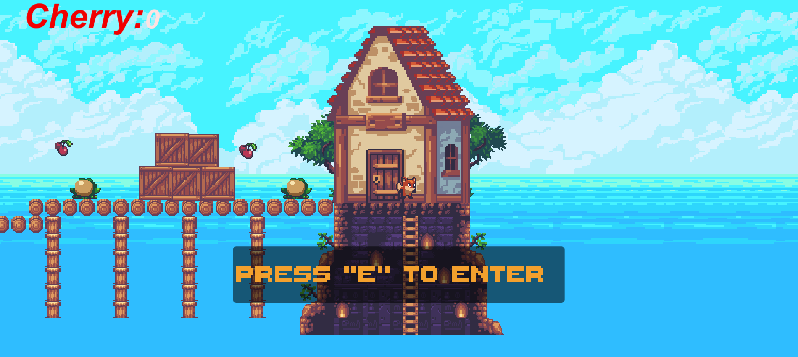
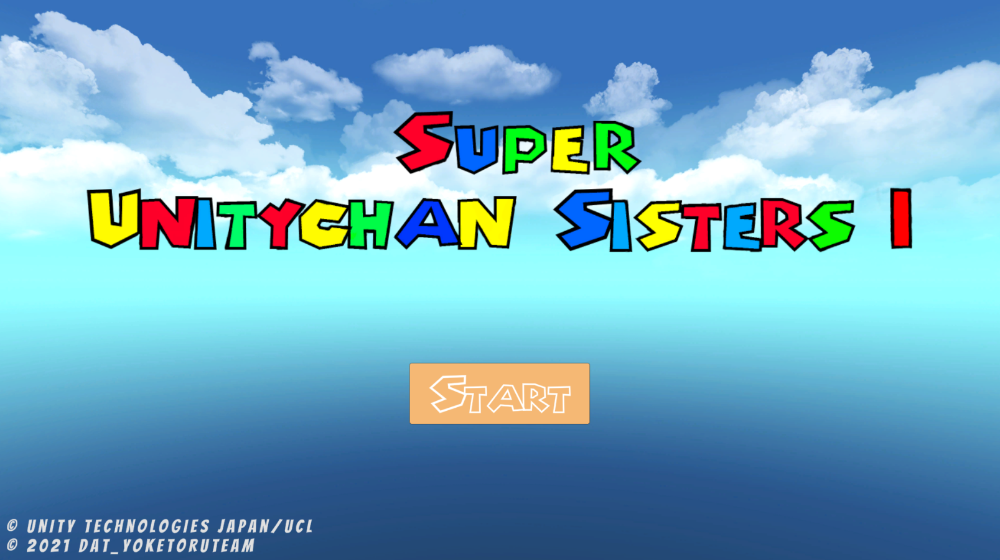
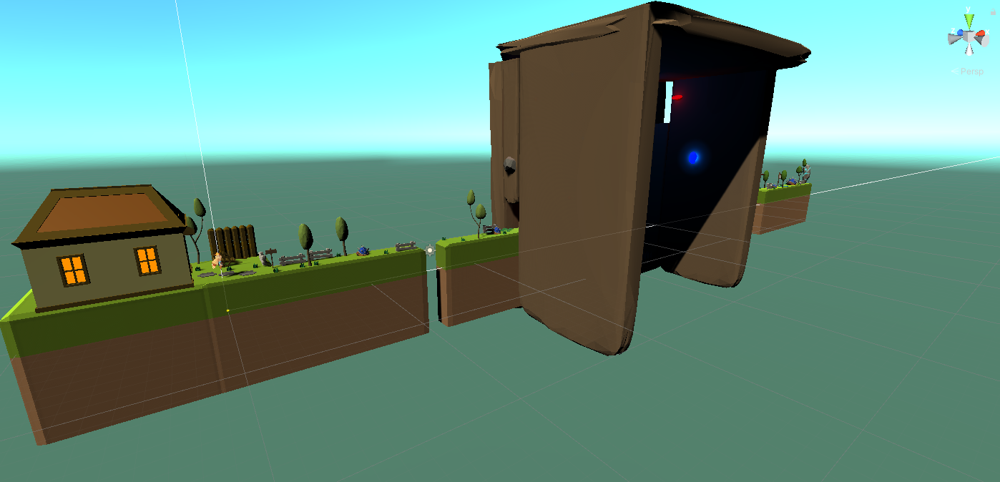
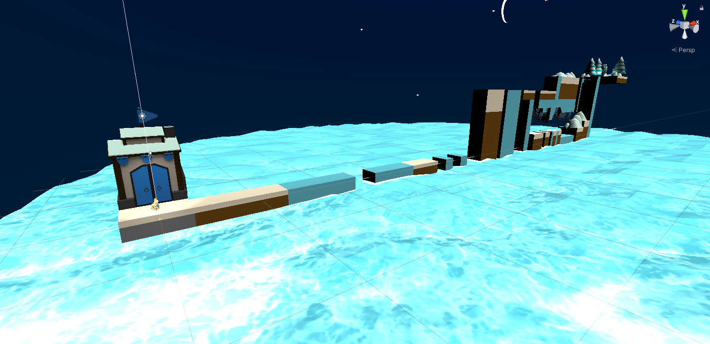
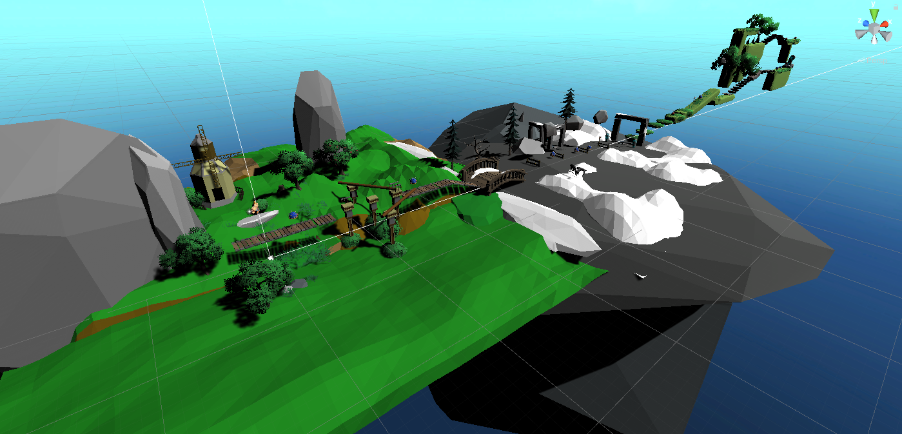
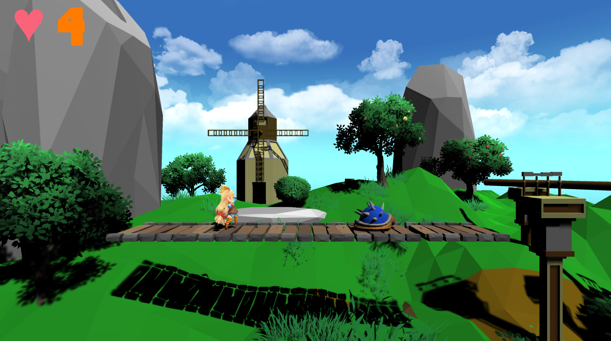
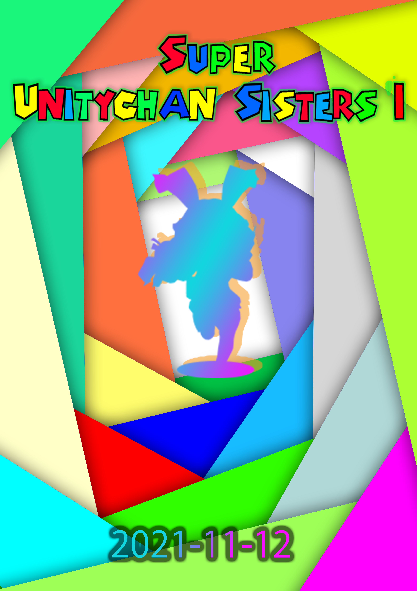
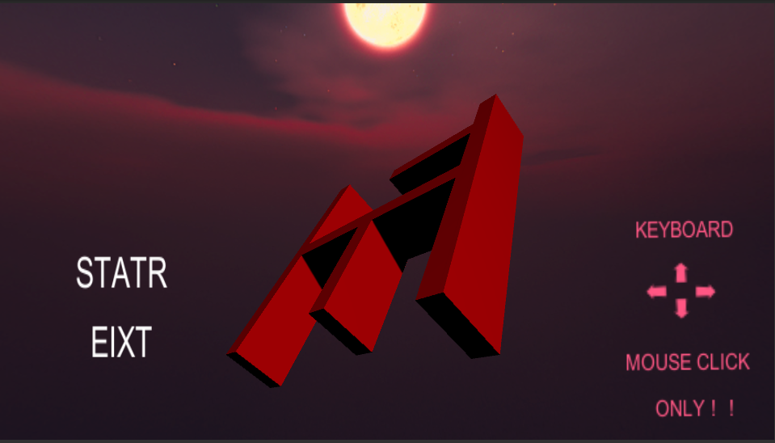
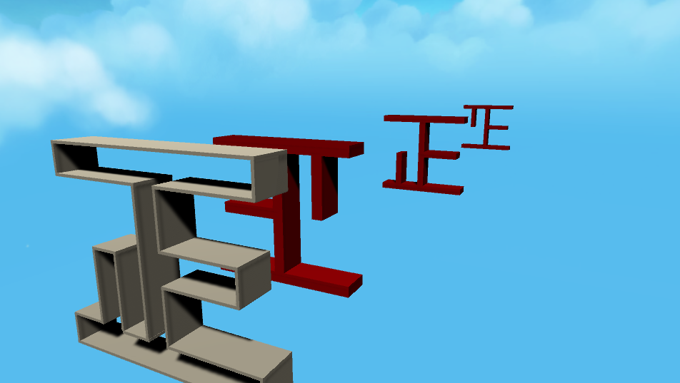

# Portfolio

- 陳金鵬(チンキンホウ)/[中国]

- 連絡先 Email [a@a.a](mailto:a@a.a)
- 専門学校デジタルアーツ東京 ゲームプログラムコース 2023年卒業予定

## 資格

## スキル
- C#
  - 利用歴1年
- Unity
  - 利用歴1年
  - 独立でシンプルなゲームを作られます
- C/C++
  - 利用歴1年

## 取り組んでいるテーマ

-言語の勉強

## 作品リスト

### FirstGame

[FirstGame]

作品概要　自分がはじめに作った２Dゲームです。夏休みの宿題として、(https://www.youtube.com/c/MStudioUnity)から見ながら作った２Dゲームです。

- 開発環境：untiy
- 開発期間：2週間

### SuperUnitychanSisters

[SuperUnitychanSisters]

作品概要 はじめにクラスメイトとの団体作品2.5Dゲームです。下から3番目と2番目がは私が作ったstate3とポスターです。

- 開発環境：untiy
- 開発期間：１カ月半

### 正解

[正解]

作品概要　正月宿題とする二週間ゲームです。完成度90％ぐらいです。つづく中。

- 開発環境：untiy
- 開発期間：1日

## 連絡先
- E-mail [a@a.a](mailto:a@a.a)
