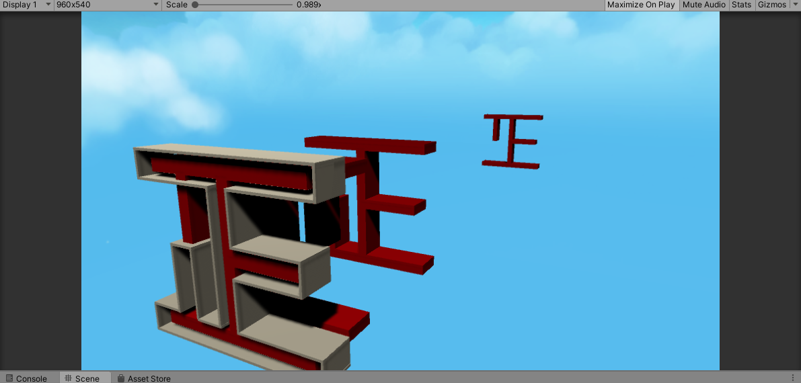
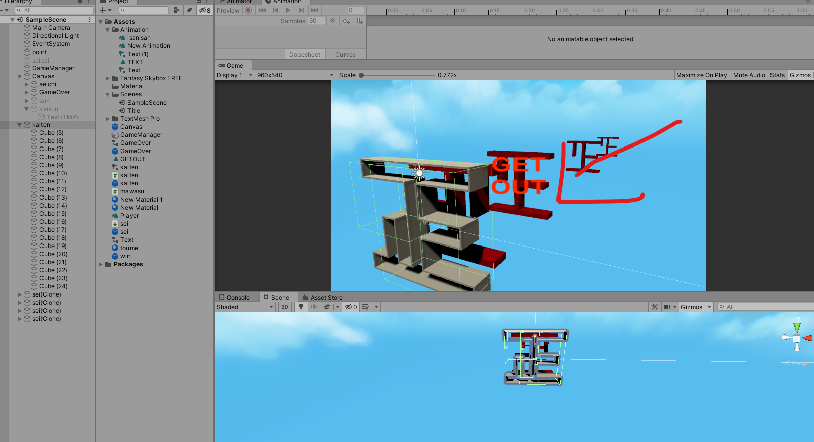
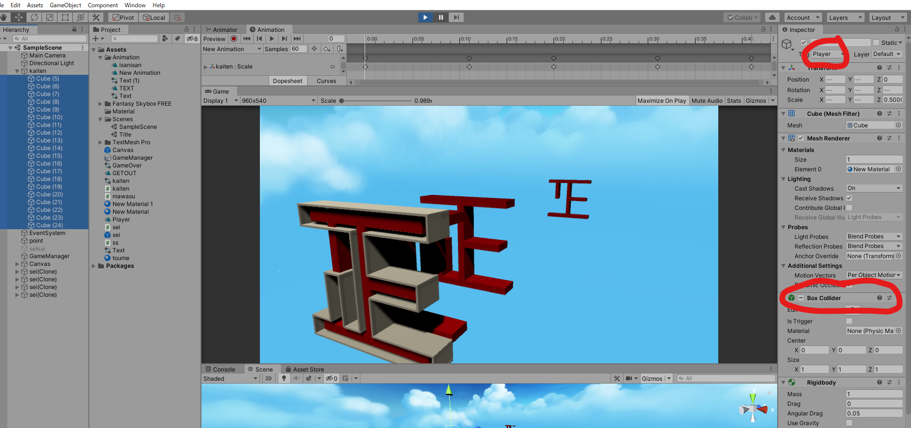
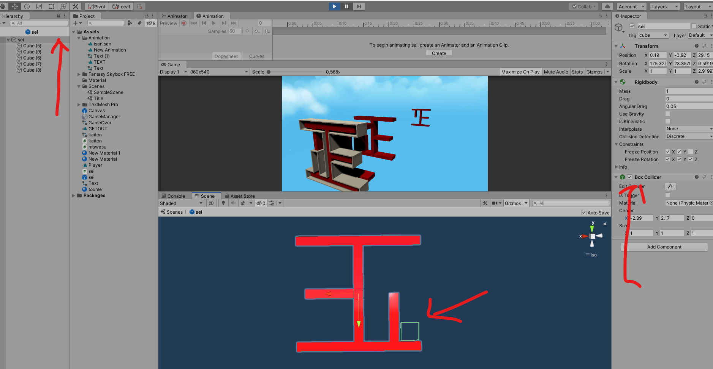
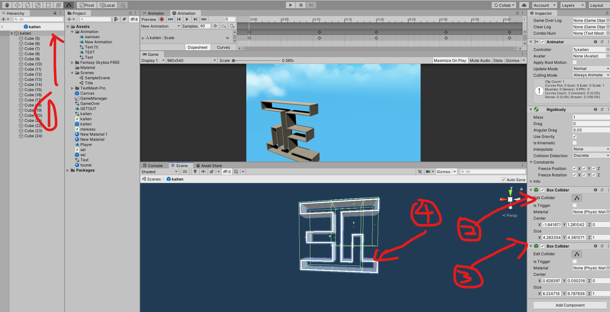

- 陳金鵬(チンキンホウ)/[中国]

## 正月宿題の問題

- colliderが付いたのに当たり判定が反応なし,以下のよう
[]()
- 当たったら、画面はこのように表示するが、できなかった最初は
[]()

### ===========================================================

## なぜこうなるか

- 今回二つの正字の模型は多数のcubeで作られたものでした、以下図のように、最初空のオブジェクトを作て、多数のcubeをぱっと入れて済むと考えましたが、実行した時、当たる反応なし、Tag層も作てますし、cubeにもBOXColliderをいれ済み、コードもちゃんと正しく書いてましたが、Debugして見たら、当たってなかった。colliderがどこかでmissしてた。二つの正にすべてのcubeのColliderを消して、空オブジェクトにBOXCollider一つ追加して、実行して、当たった。原因はコードの置く場所とColliderが同じオブジェクトじゃないから。本当に基礎的です。
### ===========================================================
```cs
public void OnCollisionEnter(Collision collision)
   {
       if (collision.collider.CompareTag("cube"))
       {
           GameOverLog.SetActive(true);
       }
   }
```

   []()

===========================================================

## 解決方法

- この正にcube20個以上なんで一個ずつコードつくとちょっと面倒なので、Cubeの親だけにColliderを設置すればいいです、完璧ではないが、一応解決できます。以下のように


   []()


###　===========================================================

## 解決方法

-  解決方法はとても簡単です、Cubeの親だけにColliderを設置すればいいです、完璧ではないが、以下のように
>>>>>>> e58877ea6f57e4e3a7fb92ec70df762a2315facf

[]()

[]()
